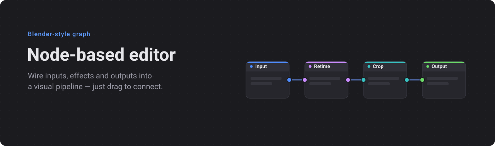
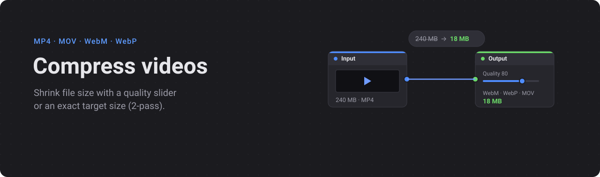
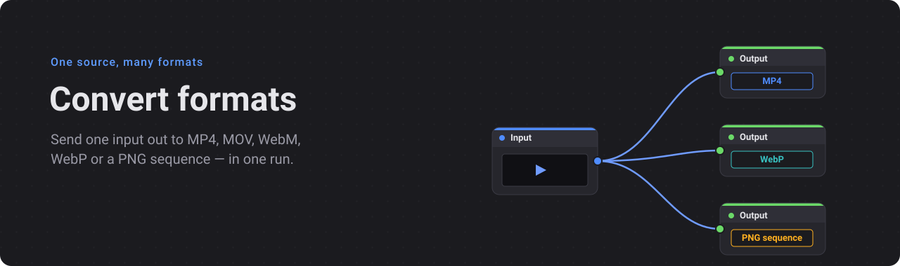
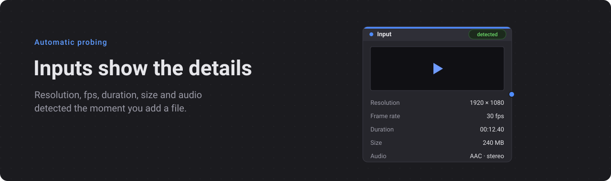
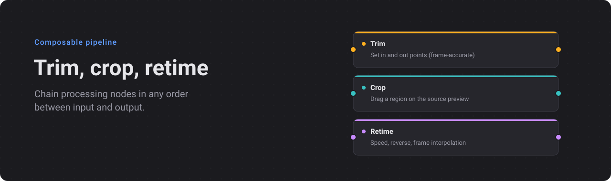

# Compressor

A node-based media compressor (Electron + React + React Flow). Convert PNG
sequences and video into WebP / MP4 (H.264·H.265·AV1) / MOV (ProRes) / WebM (VP9) /
APNG / PNG (sequence or single frame), with a Blender-style node graph for
chaining Trim, Crop and Retime stages.











## Features

- **Inputs**: PNG sequence (auto fps/frame-count/size detection) or video (fps,
  resolution, duration, audio probed automatically).
- **Outputs**: WebP (animated, alpha via `img2webp`), MP4 (H.264 / H.265 / AV1,
  hardware VideoToolbox option), MOV (ProRes Proxy→4444 with alpha, or
  HEVC-with-Alpha), WebM (VP9 with alpha), APNG (lossless animated, full alpha),
  PNG sequence (lossless frames to a folder) or a single chosen frame.
- **Alpha preserved across formats**: transparent sources — including VP8/VP9
  WebM/MKV (decoded via libvpx so alpha isn't dropped), ProRes 4444 and
  HEVC-with-Alpha — carry their transparency through to any alpha-capable output.
  HEVC-with-Alpha is premultiplied before encoding so QuickTime/Safari render it
  cleanly (no magenta fringing). Sending a transparent source to an output that
  can't keep alpha shows a warning that transparency will bake to black.
- **Loop / Boomerang**: bake a back-and-forth (ping-pong) loop into any output.
- **Quality or target file size** (2-pass) per output.
- **Processing nodes**: Trim (in/out), Crop, Retime (speed / reverse / frame
  interpolation), composable in any chain. An upstream Crop drives the Output's
  size and preview.
- **Previews**: hover an Input to play a small animated preview; each Output
  shows an animated result preview and final file size when it finishes. (The
  bundled decoder can't display HEVC-with-Alpha transparency, so that preview
  shows on black — the exported file is still correct.)
- Blender-style graph: a knife/scissors tool to cut links (toolbar toggle, or
  Ctrl/⌘-drag), drop a node onto a link to splice it in, per-node delete,
  save/load graph as JSON. Run/Stop with ⌘↵/Esc.
- Batch queue with progress, cancel, and reveal-in-Finder.

## Install (macOS)

The app is not code-signed, so on first launch macOS Gatekeeper blocks it
("app is damaged / cannot verify developer"). To open it:

1. Download the matching DMG from
   [Releases](https://github.com/khk1997/compressor-editor/releases) — Apple
   Silicon → `-arm64.dmg`, Intel → `.dmg` — and drag **Compressor Editor** into
   Applications.
2. In Terminal, clear the quarantine attribute:

   ```bash
   xattr -cr "/Applications/Compressor Editor.app"
   ```

3. Open it normally from Applications.

## Develop

```bash
npm install
npm run dev
```

FFmpeg is bundled via `ffmpeg-static`. Animated-WebP frame disposal uses
`img2webp` (libwebp) from PATH; bundling it is required for distribution.
